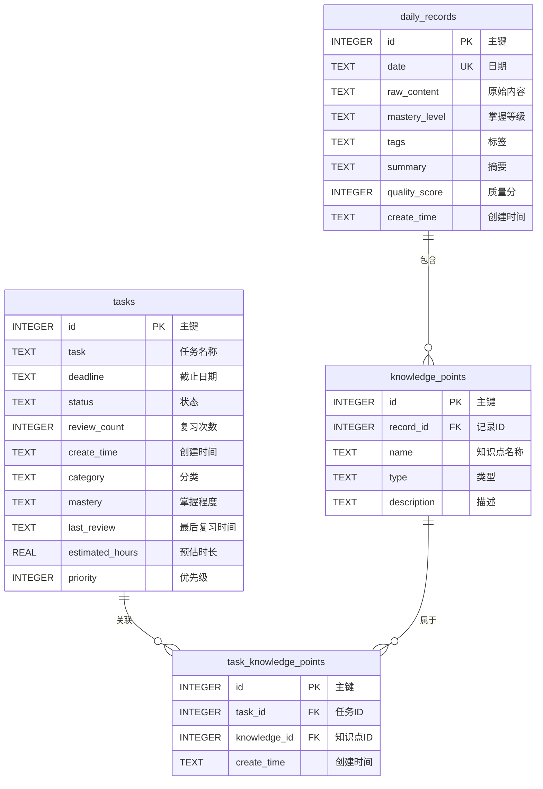
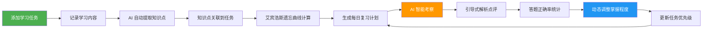
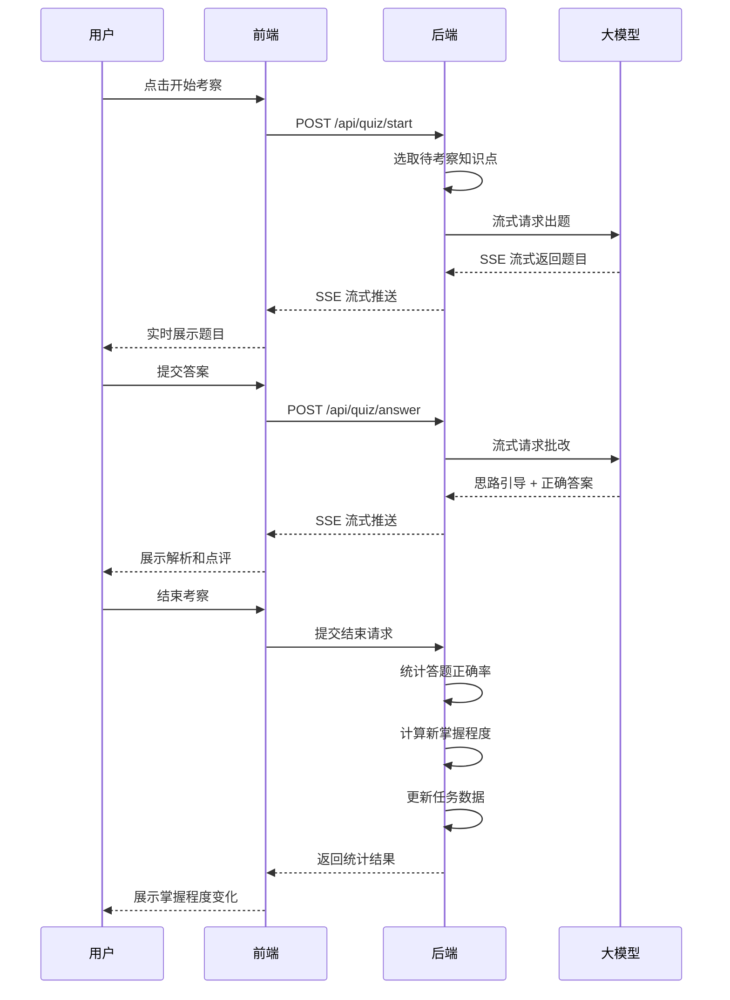

# 📚 Study Agent - AI 驱动的智能学习助手

> 基于艾宾浩斯遗忘曲线 + AI 智能考察的个性化学习助手，让你的学习更高效、记忆更牢固。


---

## ✨ 功能特性

### 🎯 任务管理
- 智能任务优先级排序（截止日期 + 掌握程度 + 复习紧急度）
- 任务分类管理，支持自定义类别
- 掌握程度追踪：生疏 → 一般 → 熟悉 → 精通
- 自动计算下次复习时间

### 🧠 知识点管理
- 自动从学习记录中提取知识点
- 知识点类型分类（概念/原理/算法/工具等）
- 知识点与任务智能关联
- 关键词匹配算法，支持模糊关联

### 📅 智能复习计划
- **艾宾浩斯遗忘曲线算法**：自动计算最佳复习节点（第1/2/4/7/15天）
- 每日复习计划自动生成，按遗忘紧急度排序
- 复习任务卡片展开，直接查看关联知识点
- 一键开始复习考察

### 🤖 AI 智能考察
- **大厂压力面试风格**：犀利、追问、不留情面
- 7 种题型混合：原理理解、应用场景、对比分析、场景设计、排错分析、手撕代码、边界 case
- **引导式解析**：先带思路，再给答案，不是直接甩结果
- 流式出题，实时响应

### 📊 掌握程度评估
- 答题正确率自动统计
- 根据考察结果动态调整掌握程度
- 复习次数累计追踪
- 答题统计卡片可视化展示

### 💬 自由对话
- AI 学习助手随时解答疑问
- 学习记录自动保存
- 对话历史持久化存储

---

## 🛠 技术栈

| 类别 | 技术 | 说明 |
|------|------|------|
| **后端** | Flask 3.x | 轻量级 Web 框架 |
| **前端** | 原生 JavaScript + CSS3 | 无框架依赖，加载快 |
| **数据库** | SQLite | 轻量、无需额外部署 |
| **AI 模型** | 智谱AI (GLM-4-Flash) | 大模型驱动智能考察 |
| **流式响应** | SSE (Server-Sent Events) | 实时流式出题和批改 |
| **算法** | 艾宾浩斯遗忘曲线 | 科学记忆算法 |

---

## 🗄 数据库设计

### 数据表关系图



### 表说明

| 表名 | 说明 | 核心字段 |
|------|------|----------|
| **tasks** | 学习任务表 | task, deadline, mastery, priority, review_count |
| **daily_records** | 每日学习记录表 | date, raw_content, summary, quality_score |
| **knowledge_points** | 知识点表 | name, type, description, record_id |
| **task_knowledge_points** | 任务-知识点关联表 | task_id, knowledge_id（多对多关系） |

---

## 🔄 业务流程

### 完整使用流程图



### 考察模式流程



---

## 🧮 核心算法

### 1. 艾宾浩斯遗忘曲线复习调度
基于艾宾浩斯遗忘曲线理论，自动计算最佳复习时间点：

```
复习节点：第1天 → 第2天 → 第4天 → 第7天 → 第15天
```

- 距离复习节点越近，优先级越高
- 超过15天未复习的内容，优先级最高
- 结合掌握程度动态调整复习频率

### 2. 知识点智能关联算法
- 提取任务名称中的关键词（过滤停用词）
- 与知识点名称做多维度关键词匹配
- 评分加权：关键词长度 × 出现次数
- 超过阈值即自动建立关联关系

### 3. 掌握程度动态评估
考察结束后根据答题正确率自动调整：

| 正确率 | 答题数 ≥ 3 | 变化 |
|--------|-----------|------|
| ≥ 85% | ✅ | 升一级 |
| 50% ~ 85% | - | 保持不变 |
| < 50% | ✅ | 降一级 |

- 不完整答案按 0.5 分计算
- 答题数不足 3 道不调整（避免偶然性）

---

## 🚀 快速开始

### 环境要求
- Python 3.10+
- 智谱AI API Key

### 安装步骤

1. **克隆仓库**
```bash
git clone https://github.com/LIUGUANYI-WQ/study_agent.git
cd study_agent
```

2. **创建虚拟环境**
```bash
python -m venv .venv
# Windows
.venv\Scripts\activate
# macOS/Linux
source .venv/bin/activate
```

3. **安装依赖**
```bash
pip install -r requirements.txt
```

4. **配置 API Key**

创建 `.env` 文件：
```env
ZHIPU_API_KEY=你的智谱AI API Key
```

5. **启动服务**
```bash
# Windows
start.bat
# 或手动
python web_app.py
```

6. **访问应用**
打开浏览器访问：http://127.0.0.1:5000

---

## 📁 项目结构

```
study_agent/
├── src/
│   ├── agent.py          # 核心 Agent 逻辑
│   ├── memory.py         # 数据存储与记忆管理
│   ├── session.py        # 对话会话管理
│   └── app.py            # 命令行模式入口
├── static/
│   ├── app.js            # 前端交互逻辑
│   └── style.css         # 页面样式
├── templates/
│   └── index.html        # 主页面
├── web_app.py            # Flask Web 应用入口
├── main.py               # 命令行模式启动
├── migrate_db.py         # 数据库迁移脚本
├── requirements.txt      # Python 依赖
├── start.bat             # Windows 启动脚本
├── .gitignore            # Git 忽略配置
└── README.md             # 项目说明
```

---

## 🎯 使用指南

### 1. 添加学习任务
- 在任务管理页面添加你的学习任务
- 设置截止日期、分类、预估时长
- 系统自动计算优先级

### 2. 记录学习内容
- 在自由对话页面和 AI 聊天
- AI 会自动提取知识点并保存
- 知识点会自动关联到相关任务

### 3. 查看复习计划
- 切换到复习计划页面
- 系统自动根据遗忘曲线生成今日复习任务
- 点击任务卡片展开查看关联知识点

### 4. 开始 AI 考察
- 点击「开始考察」按钮
- AI 以大厂面试官风格出题
- 回答后会有引导式解析和点评
- 结束后自动更新掌握程度

---

## 🚢 部署方案

### 方案一：云服务器部署（推荐）
1. 购买轻量应用服务器（阿里云/腾讯云，约 30元/月）
2. 安装 Python 环境
3. 使用 Gunicorn + Nginx 部署
4. 配置域名和 HTTPS

### 方案二：免费 PaaS 平台
- **Render**：免费额度够用，支持 Python
- **Railway**：每月有免费额度
- 支持 GitHub 自动部署，push 代码自动更新

### 方案三：Docker 部署
项目支持 Docker 容器化部署，确保环境一致性。

---

## 🗺 未来规划

- [ ] 用户系统，支持多用户
- [ ] 数据可视化看板（学习时长、掌握趋势）
- [ ] 错题本自动整理
- [ ] AI 生成学习路径规划
- [ ] AI 生成思维导图
- [ ] 移动端适配 / 微信小程序
- [ ] 更多大模型支持

---

## 📝 开发笔记

项目开发过程中遇到的问题和解决方案，记录在 [遇到的问题.md](遇到的问题.md) 中。

---

## 📄 License

MIT License

---

💡 **如果这个项目对你有帮助，欢迎点个 Star ⭐ 支持一下！**
